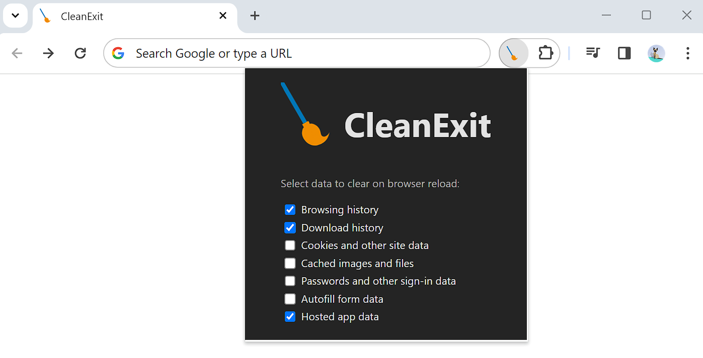

# CleanExit

<a href="https://chromewebstore.google.com/detail/cleanexit/chjjljigikgecfimljpjkbmdkiiimaop">
    
</a>

<a href="https://chromewebstore.google.com/detail/cleanexit/chjjljigikgecfimljpjkbmdkiiimaop">CleanExit</a> is a Manifest V3 browser extension that clears browsing data every time the browser is closed and re-opened.


It leverages the [browsingData API](https://developer.chrome.com/docs/extensions/reference/api/browsingData) to allow the deletion of the following data types:

* Browsing history
* Download history
* Cookies and other site data
* Cached images and files
* Passwords and other sign-in data
* Autofill form data
* Hosted app data

A simple UI is included to allow the user to select what data to clear on reload.

Currently only Chromium browsers are supported as Firefox [does not support](https://bugzilla.mozilla.org/show_bug.cgi?id=1360870) service worker modules for extensions. I have not tested on Safari.

*Available from the <a href="https://chromewebstore.google.com/detail/cleanexit/chjjljigikgecfimljpjkbmdkiiimaop">Chrome Web Store</a> and <a href="https://microsoftedge.microsoft.com/addons/detail/cleanexit/ioeaibgbcbcfggpooiphefddmfefplfk">Microsoft Edge Add-ons</a>.*


## Local development

The extension is written in TypeScript with Vite tooling. Simply clone the repo, navigate to the root and run:

```
npm install
npm run build
```

Then, on the browser extensions page, enable developer mode, select *Load unpacked* and open the `dist` directory.
